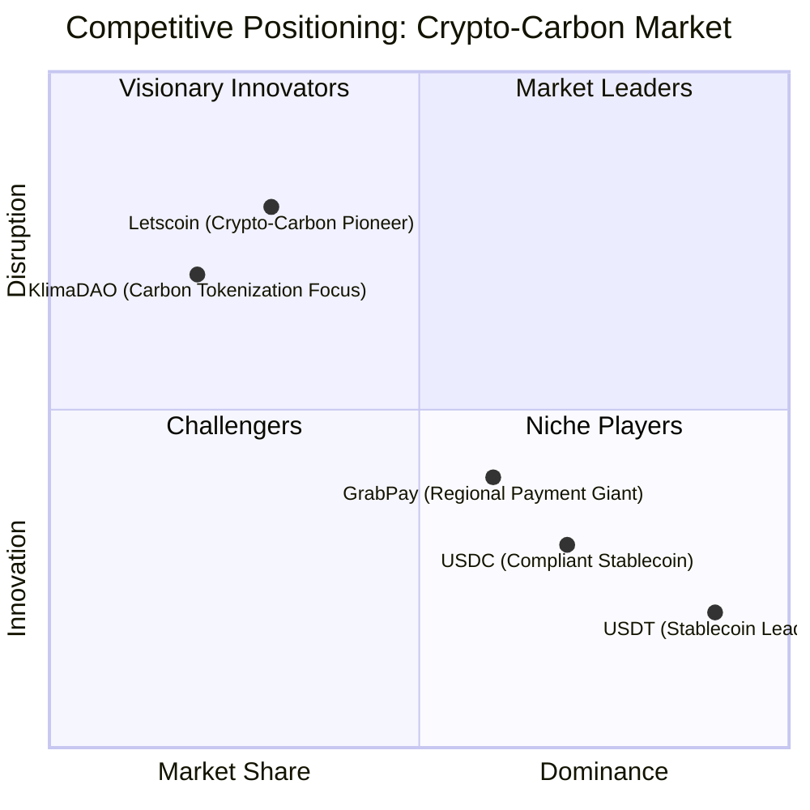
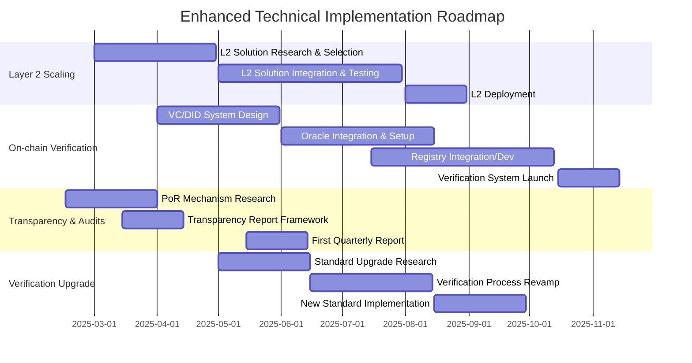

# Letscoin (LTSC) Comprehensive Analysis & Strategic Solution

+Analysis+Infographic)

**Detailed Technical, Operational, and Market Analysis with Enhanced Solution Recommendations**

[TOC]

## 1. Introduction: The Need for Crypto-Carbon Solutions

The convergence of cryptocurrency and environmental sustainability is increasingly critical. There is a growing need for innovative solutions that leverage blockchain technology to address climate change and promote ESG (Environmental, Social, Governance) principles. Traditional payment systems lack inherent mechanisms to support environmental sustainability, and the voluntary carbon market faces challenges in transparency, accessibility, and efficiency.

Letscoin (LTSC) emerges as a pioneering initiative aiming to bridge this gap. By integrating a stablecoin with carbon offsetting, LTSC proposes a novel approach to combine transactional utility with environmental impact, offering a potentially transformative solution in the crypto-carbon space. This report provides a comprehensive analysis of LTSC, evaluating its fundamentals, market position, and strategic opportunities, culminating in enhanced solution recommendations to maximize its potential.

**[Placeholder for Infographic: Illustrating the Issue - Conventional Payments vs. Crypto-Carbon]**
*Infographic: comparison between traditional payment systems and the emerging necessity for crypto-carbon solutions.*

## 2. Letscoin (LTSC) Solution Overview

Letscoin (LTSC) is designed as a dual-utility cryptocurrency, functioning both as a stablecoin for payments and as a vehicle for carbon offsetting. Built on the Polygon network, LTSC aims to provide fast, low-cost transactions while contributing to environmental sustainability by allocating a significant portion of its token supply to carbon offset projects.

**Key Value Proposition:** LTSC uniquely combines the utility of a stablecoin with verifiable environmental impact, appealing to both users seeking efficient digital payments and those prioritizing ESG considerations. Its approach aims to enhance transparency and accessibility in the carbon market by integrating carbon offsetting directly into a transactional currency.

```mermaid
graph TD
    A[Letscoin (LTSC)] --> B{Dual Utility}
    B --> C[Payment Stablecoin]
    B --> D[Verifiable Carbon Offset Instrument]
    C --> E[Polygon Network: Scalable & Cost-Effective]
    D --> F[3B MT Carbon Offsets (Claimed)]
    F --> G[Verification: Requires Robust Standards]
    A --> H[Target: Bridging Crypto & Sustainability]
## 3. Project Fundamentals Analysis

### 3.1 Tokenomics Audit

LTSC's tokenomics model is defined by a 50 billion total supply, with a strategic allocation of 30 billion tokens for carbon offsets and 20 billion for the open market. This distribution underscores its commitment to environmental sustainability alongside its function as a payment currency.

#### Token Distribution

```mermaid
pie
    title LTSC Token Distribution
    "Carbon Offsets (60%)" : 60
    "Open Market (40%)" : 40
```

*60% of LTSC tokens are dedicated to carbon offsetting, emphasizing its ESG focus.*

#### Price Stability & Reserves

As a fiat-backed stablecoin, LTSC's price stability is paramount. Transparency regarding its reserve mechanism, auditing processes, and strategies for maintaining peg stability is crucial for building market confidence.

**Enhanced Recommendation:** Implement quarterly transparency reports detailing reserve composition, liabilities, and independent audits by a reputable firm. Explore Proof of Reserves (PoR) mechanisms for on-chain verification.

#### Transaction Costs & Yield Mechanisms

Leveraging Polygon, LTSC aims for cost-efficient transactions. Comparative analysis against USDT, USDC, and regional payment solutions, including quantified transaction fees and potential yield opportunities (e.g., staking, savings accounts), is needed to assess its competitive positioning.

### 3.2 Technology Stack Review

#### Polygon Network Advantages

*   **Scalability:** High TPS for payment processing.
*   **Low Transaction Fees:** Enhances user experience and micro-transactions.
*   **EVM Compatibility:** Facilitates integration with Ethereum ecosystem.

#### Security & Tokenization

*   **Smart Contract Audits:** Conduct comprehensive security audits by leading firms and publish audit reports to enhance trust.
*   **KTX Tokenization System:** Provide detailed documentation on the KTX system's architecture and its role in managing carbon credits and LTSC tokens.

## 4. Carbon Credit Initiative Deep Dive

The carbon credit initiative is fundamental to LTSC's identity. This section delves into the specifics of its carbon credit strategy and benchmarks it against industry standards.

### 4.1 Carbon Credit Metrics & Benchmarking

| Metric                  | Letscoin Position | Industry Benchmark   | Enhanced Analysis & Recommendation                                                    |
| ----------------------- | ----------------- | -------------------- | ------------------------------------------------------------------------------------- |
| **Carbon Credit Volume** | 3B MT             | 2025 Market Avg      | Significant volume claim requires validation of credit quality and effective utilization. Benchmark "2025 Market Avg" needs clarification and comparison against total market volume projections. |
| **Verification Standard**| Paris Ch6         | Gold Standard, Verra | "Paris Ch6" is a framework, not a standard. **Enhanced Recommendation:** Adopt and rigorously implement recognized standards like Gold Standard or Verra. Ensure independent third-party verification for all projects. |
| **Corporate Adoption**  | 300+ Companies    | Major Registries     | Early adoption is promising, but further detail on the nature of adoption (pilot vs. full-scale) and the volume of credits transacted is needed to assess real impact. |

```mermaid
graph LR
    A[Carbon Credit Initiative] --> B{Verification & Quality Assurance}
    B --> C[Adopt Gold Standard/Verra (Minimum)]
    B --> D[Independent 3rd Party Verification]
    A --> E{Volume & Utilization}
    E --> F[Validate 3B MT Claim]
    E --> G[Transparent Utilization Reporting]
    A --> H{Corporate Adoption Impact}
    H --> I[Quantify Adoption Depth & Credit Volume]
```

## 5. Market Positioning Analysis

Analyzing Letscoin's market position is crucial for understanding its competitive landscape and strategic direction. This section evaluates its standing against key competitors and assesses regulatory risks.

### 5.1 Competitive Landscape

#### Competitive Quadrant Chart



Letscoin is positioned as a "Visionary Innovator," characterized by its novel crypto-carbon approach but with lower current market share compared to established stablecoins and regional payment giants. This quadrant highlights its disruptive potential and the need to scale adoption.

#### Key Competitor Analysis

*   **Stablecoin Rivals (USDT, USDC):** Market dominance in payments, liquidity, network effects. LTSC must differentiate on ESG and utility.
*   **Carbon Credit Platforms (Toucan, KlimaDAO):** Focus on carbon tokenization. LTSC's payment integration offers a unique value proposition.
*   **Regional Payment Gateways (GrabPay, GoPay, DANA):** Strong regional presence and user base. Competition will be market-specific.

### 5.2 Regulatory Risk Assessment

#### Regulatory Landscape

*   **MiCA Compliance:** Adherence to EU's MiCA regulations is crucial for stablecoin operations and global standard-setting.
*   **Carbon Credit Tokenization Legality:** Evolving legal frameworks for tokenized carbon credits create uncertainty. Legal recognition, double counting prevention, and jurisdictional clarity are essential.

**Enhanced Recommendation:** Proactively engage with regulatory bodies and legal experts to ensure compliance and advocate for clear, supportive regulations for crypto-carbon assets.

## 6. SWOT Analysis Synthesis

**[Placeholder for Infographic: SWOT Analysis Summary - Strengths, Weaknesses, Opportunities, Threats in a visually engaging format]**
*Infographic: Summarizing Letscoin's SWOT analysis in a visually digestible format.*

### Strengths

*   First-mover in crypto-carbon payments.
*   Dual utility: payment + ESG instrument.
*   Strategic alliance with Bluegrace Energy (verify).
*   Claimed 3B MT Carbon Offsets (verify verification).
*   Polygon Network: fast, low cost.
*   Early corporate adoption (300+ companies).

### Weaknesses

*   Lack of transparency: price stability, reserves.
*   Unclear carbon credit verification ("Paris Ch6").
*   KTX Tokenization System: unexplained.
*   Potential dependence on single carbon credit supplier.
*   Untested mass adoption beyond pilot markets.

### Opportunities

*   Banking partnerships: LTSC as reserve asset.
*   Expansion to Article 6 carbon markets.
*   DeFi integrations: enhance utility.
*   Emerging market expansion: remittance + ESG.
*   ESG-focused corporate partnerships.

### Threats

*   Polygon network congestion risks.
*   Carbon credit price volatility.
*   Stablecoin market saturation.
*   Regulatory tightening on crypto.
*   Competition: crypto-carbon initiatives.
*   Greenwashing risks: verification integrity.

## 7. Recommendations Engine: Enhanced Solutions

Based on the comprehensive analysis, this section outlines enhanced and specific recommendations categorized into technical improvements and market expansion strategies to strengthen Letscoin's position and mitigate identified risks.

### 7.1 Enhanced Technical Improvements

*   **Layer 2 Scaling Solutions:**
    *   zk-Rollups: For enhanced security focus.
    *   Optimistic Rollups: For EVM compatibility and faster deployment.
    *   Validium: Consider for potentially lower costs, with careful evaluation of security trade-offs.
    *   Adopt a phased approach, starting with a suitable Layer 2 and evolving as transaction volume grows.

*   **On-chain Proof-of-Impact Verification:**
    *   Verifiable Credentials (VCs): To represent carbon offset certificates on-chain.
    *   Decentralized Identifiers (DIDs): For unique project and stakeholder identification.
    *   Decentralized Oracles: For bringing verified off-chain data (registry, audit data) onto the blockchain.
    *   Integrate with existing blockchain carbon registries or develop a dedicated registry.
    *   Implement tiered verification rigor levels from basic registration to advanced continuous monitoring.

*   **Transparency Enhancement - Reserves & Audits:**
    *   Publish quarterly transparency reports on the official website and potentially on-chain.
    *   Include detailed reserve breakdowns, liabilities, and independent audit reports from reputable firms (e.g., Big Four).
    *   Explore and implement Proof of Reserves (PoR) mechanisms for on-chain verifiable reserves.

*   **Strengthen Carbon Credit Verification Standards:**
    *   Adopt Gold Standard or Verra VCS as minimum verification standards.
    *   Explore specialized standards for specific project types relevant to LTSC’s carbon credit portfolio.
    *   Mandate independent third-party verification for all carbon offset projects.
    *   Provide publicly accessible documentation on verification methodologies and additionality criteria.



### 7.2 Enhanced Market Expansion Strategies

*   **Targeted Marketing & Audience Segmentation:**
    *   Corporations with Net-Zero Targets: Highlight LTSC for ESG-aligned payments and carbon offsetting.
    *   ESG-Focused Investment Funds: Position LTSC as an ESG-compliant digital asset.
    *   Environmentally Conscious Retail Users: Target tech-savvy demographics with messaging on sustainability and efficient payments.
    *   Crypto-Native ESG Communities: Engage with existing communities focused on crypto and environmental impact.
    *   Utilize digital marketing, content marketing, ESG media partnerships, and community building.

*   **Strategic Partnerships - Ecosystem Expansion:**
    *   Remittance Service Providers: Integrate LTSC for cost-effective, ESG-aligned remittances.
    *   E-commerce Platforms: Partner with ESG-focused marketplaces for LTSC payments and carbon offsetting at checkout.
    *   ESG NGOs & Environmental Organizations: Collaborate on awareness, joint projects, and LTSC donations to environmental causes.
    *   Government Initiatives: Explore partnerships for digital currency and carbon reduction programs in target markets.
    *   Develop a standardized partnership framework outlining value exchange and co-marketing.

*   **DeFi & CeFi Integrations - Utility & Accessibility:**
    *   DeFi Platforms: Target lending platforms (Aave, Compound) for LTSC collateral listings, DEXs (Uniswap, SushiSwap) for trading pairs, and yield aggregators for optimized yields.
    *   CeFi Exchanges: Pursue listings on exchanges known for ESG asset support and major global exchanges for broader access and liquidity.
    *   Engage with traditional financial institutions exploring crypto and ESG asset custody.

*   **Comprehensive Education & Awareness Campaigns:**
    *   Create a content hub with blog posts, articles, infographics, videos, and webinars explaining LTSC and crypto-carbon solutions.
    *   Develop interactive dashboards showcasing LTSC’s carbon impact and project details for transparency.
    *   Tailor content for diverse audiences: general public, crypto community, and corporate decision-makers.
    *   Utilize social media, website, email marketing, online advertising, industry events, and partnerships with educational platforms for distribution.

## 8. Risk Mitigation Matrix

| Risk                    | Mitigation Strategy                                                                                                                                                                                                | Priority |
| ----------------------- | -------------------------------------------------------------------------------------------------------------------------------------------------------------------------------------------------------------------- | -------- |
| **Regulatory Tightening**| Proactive compliance measures, engage with regulators, secure legal counsel, design flexible architecture adaptable to regulatory changes.                                                                              | High     |
| **Market Saturation**   | Differentiate through strong ESG value proposition, build a robust brand narrative, forge strategic partnerships for ecosystem growth.                                                                                 | High     |
| **Carbon Credit Volatility**| Diversify carbon credit sourcing across project types and geographies, implement hedging strategies, ensure transparent and predictable pricing mechanisms.                                                        | Medium   |
| **Polygon Congestion**  | Implement advanced Layer 2 scaling solutions, explore interoperability with other scalable blockchains to distribute transaction load.                                                                                | Medium   |
| **Transparency Concerns**| Publish regular, detailed audit reports, ensure comprehensive documentation, implement on-chain proof-of-impact and reserves verification systems.                                                                       | High     |
| **Greenwashing Accusations**| Ensure rigorous carbon credit verification using top-tier standards (Gold Standard/Verra), maintain transparent reporting on carbon offset projects and their impact.                                                  | High     |
| **Competition**         | Drive continuous innovation in crypto-carbon solutions, strengthen unique value proposition (ESG + payments), implement targeted and effective marketing strategies.                                                        | Medium   |

## 9. Conclusion

Letscoin (LTSC) presents a compelling and innovative approach by integrating a payment stablecoin with carbon offsetting, positioning itself at the forefront of the emerging crypto-carbon market. Its dual utility and first-mover advantage offer significant potential. However, realizing this potential hinges on addressing critical weaknesses, particularly around transparency and carbon credit verification, and effectively executing enhanced market expansion strategies.

By implementing the enhanced technical improvements and market strategies outlined in this report, LTSC can solidify its market position, build trust and credibility, and capitalize on the growing demand for both efficient digital payments and sustainable, ESG-aligned solutions. The path forward requires a commitment to transparency, rigorous verification, strategic partnerships, and continuous innovation to navigate the evolving crypto and carbon landscapes and achieve its transformative vision.

---

**For more details and visuals, please refer to the full HTML report.**


*This `README.md` file provides a comprehensive analysis of Letscoin (LTSC) as of February 3, 2025.*
```
