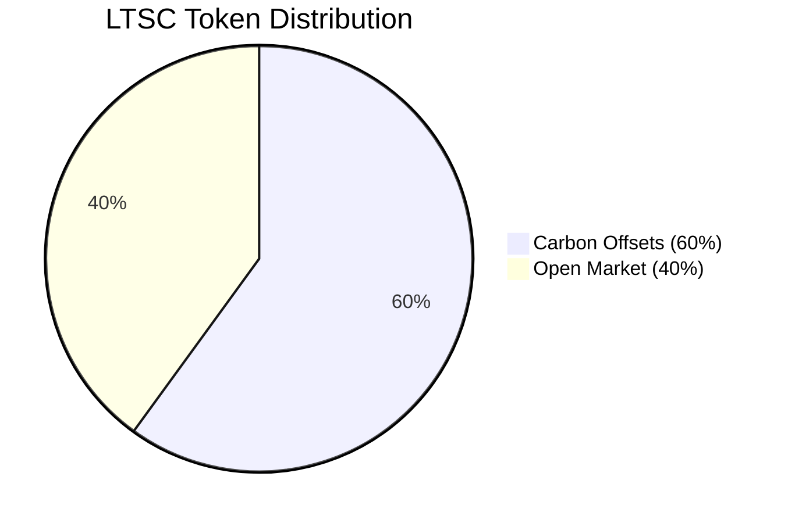
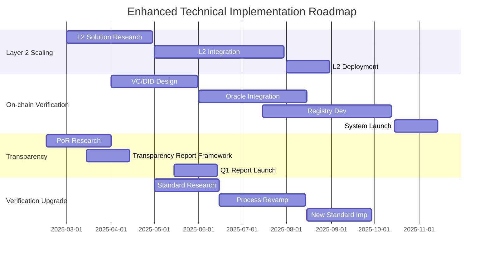

# Letscoin (LTSC) Comprehensive Analysis & Strategic Solution
```markdown
[+Analysis+Banner)](https://via.placeholder.com/800x200/4299E1/FFFFFF?text=Letscoin+(LTSC)+Analysis+Banner)
```
**Detailed Technical, Operational, and Market Analysis with Enhanced Solution Recommendations**

[TOC]

## 1. Introduction: The Need for Crypto-Carbon Solutions

The convergence of cryptocurrency and environmental sustainability is increasingly critical. There is a growing need for innovative solutions that leverage blockchain technology to address climate change and promote ESG (Environmental, Social, Governance) principles. Traditional payment systems lack inherent mechanisms to support environmental sustainability, and the voluntary carbon market faces challenges in transparency, accessibility, and efficiency.

Letscoin (LTSC) emerges as a pioneering initiative aiming to bridge this gap. By integrating a stablecoin with carbon offsetting, LTSC proposes a novel approach to combine transactional utility with environmental impact, offering a potentially transformative solution in the crypto-carbon space. This report provides a comprehensive analysis of LTSC, evaluating its fundamentals, market position, and strategic opportunities, culminating in enhanced solution recommendations to maximize its potential.

### Traditional Payments vs. Crypto-Carbon Solutions Infographic

**[Infographic: Two-Column Comparison]**

This section outlines a comparison between Traditional Payment Systems and Crypto-Carbon Solutions like Letscoin, highlighting their differences across key features:

**Column 1: Traditional Payments (The Problem)**

[Icon: 💳 - Credit Card - Gray Scale]

*   **Focus:** Transactional Efficiency
    > Primarily optimized for speed and cost of transactions.
*   **Environmental Impact:** Indirect, Often Negative
    > Indirect environmental costs (energy, resource use) with potential negative externalities.
*   **ESG Integration:** Limited
    > ESG considerations are external add-ons, not core to system design.
*   **Transparency:** Variable
    > Transparency levels vary; often opaque in operations and environmental impact reporting.

---

**Column 2: Crypto-Carbon Solutions (Letscoin) - The Solution**

[Icon: 🌱 - Seedling - Green Color]

*   **Focus:** Efficiency & Sustainability
    > Balances transaction efficiency with core environmental sustainability goals.
*   **Environmental Impact:** Direct Positive
    > Direct positive impact through carbon offsetting and incentivizing sustainable practices.
*   **ESG Integration:** Core Component
    > ESG principles are fundamentally integrated into the system and tokenomics.
*   **Transparency:** Potentially Higher
    > Blockchain technology offers potential for enhanced transparency in operations and impact verification.

---

*Infographic: Textual representation comparing key features of Traditional Payment Systems and Crypto-Carbon Solutions like Letscoin.*

## 2. Letscoin (LTSC) Solution Overview

Letscoin (LTSC) is designed as a dual-utility cryptocurrency, functioning both as a stablecoin for payments and as a vehicle for carbon offsetting. Built on the Polygon network, LTSC aims to provide fast, low-cost transactions while contributing to environmental sustainability by allocating a significant portion of its token supply to carbon offset projects.

**Key Value Proposition:** LTSC uniquely combines the utility of a stablecoin with verifiable environmental impact, appealing to both users seeking efficient digital payments and those prioritizing ESG considerations. Its approach aims to enhance transparency and accessibility in the carbon market by integrating carbon offsetting directly into a transactional currency.

```mermaid
graph TD
    A[Letscoin (LTSC)] --> B{Dual Utility}
    B --> C[Payment Stablecoin]
    B --> D[Verifiable Carbon Offset Instrument]
    C --> E[Polygon Network: Scalable & Cost-Effective]
    D --> F[3B MT Carbon Offsets (Claimed)]
    F --> G[Verification: Requires Robust Standards]
    A --> H[Target: Bridging Crypto & Sustainability]
```

## 3. Project Fundamentals Analysis

### 3.1 Tokenomics Audit

LTSC's tokenomics model is defined by a 50 billion total supply, with a strategic allocation of 30 billion tokens for carbon offsets and 20 billion for the open market. This distribution underscores its commitment to environmental sustainability alongside its function as a payment currency.

#### Token Distribution



*60% of LTSC tokens are dedicated to carbon offsetting, emphasizing its ESG focus.*

#### Price Stability & Reserves

As a fiat-backed stablecoin, LTSC's price stability is paramount. Transparency regarding its reserve mechanism, auditing processes, and strategies for maintaining peg stability is crucial for building market confidence.

**Enhanced Recommendation:** Implement quarterly transparency reports detailing reserve composition, liabilities, and independent audits by a reputable firm. Explore Proof of Reserves (PoR) mechanisms for on-chain verification.

#### Transaction Costs & Yield Mechanisms

Leveraging Polygon, LTSC aims for cost-efficient transactions. Comparative analysis against USDT, USDC, and regional payment solutions, including quantified transaction fees and potential yield opportunities (e.g., staking, savings accounts), is needed to assess its competitive positioning.

### 3.2 Technology Stack Review

#### Polygon Network Advantages

*   **Scalability:** High TPS for payment processing.
*   **Low Transaction Fees:** Enhances user experience and micro-transactions.
*   **EVM Compatibility:** Facilitates integration with Ethereum ecosystem.

#### Security & Tokenization

*   **Smart Contract Audits:** Conduct comprehensive security audits by leading firms and publish audit reports to enhance trust.
*   **KTX Tokenization System:** Provide detailed documentation on the KTX system's architecture and its role in managing carbon credits and LTSC tokens.

## 4. Carbon Credit Initiative Deep Dive

The carbon credit initiative is fundamental to LTSC's identity. This section delves into the specifics of its carbon credit strategy and benchmarks it against industry standards.

### 4.1 Carbon Credit Metrics & Benchmarking

| Metric                  | Letscoin Position | Industry Benchmark   | Analysis & Recommendation                                                    |
| :---------------------- | :---------------- | :------------------- | :--------------------------------------------------------------------------- |
| **Carbon Credit Volume** | 3B MT             | 2025 Market Avg      | Validate volume & utilization. Clarify benchmark.                           |
| **Verification Standard**| Paris Ch6         | Gold Standard, Verra | Adopt robust standards like Gold Standard/Verra.                              |
| **Corporate Adoption**  | 300+ Companies    | Major Registries     | Quantify adoption depth & credit volume.                                    |


## 5. Market Positioning Analysis

Analyzing Letscoin's market position is crucial for understanding its competitive landscape and strategic direction. This section evaluates its standing against key competitors and assesses regulatory risks.

### 5.1 Competitive Landscape

#### Competitive Quadrant Chart


Letscoin is positioned as a "Visionary Innovator," characterized by its novel crypto-carbon approach but with lower current market share compared to established stablecoins and regional payment giants. This quadrant highlights its disruptive potential and the need to scale adoption.

#### Key Competitor Analysis

*   **Stablecoin Rivals (USDT, USDC):** Market dominance, liquidity. Differentiate on ESG.
*   **Carbon Credit Platforms (Toucan, KlimaDAO):** Carbon tokenization focus. Payment integration is LTSC's edge.
*   **Regional Payment Gateways (GrabPay, GoPay, DANA):** Strong regionally. Market-specific competition.

### 5.2 Regulatory Risk Assessment

#### Regulatory Landscape

*   **MiCA Compliance:** Crucial for stablecoins, sets global standards.
*   **Carbon Credit Tokenization Legality:** Evolving, uncertain legal frameworks.

**Enhanced Recommendation:** Engage regulators, ensure compliance, advocate for crypto-carbon regulations.

## 6. SWOT Analysis Synthesis

**[Infographic Placeholder: SWOT Analysis Summary]**

*[Description: A visually engaging infographic summarizing Letscoin's SWOT analysis.  This infographic would ideally use icons and concise text to present the key Strengths, Weaknesses, Opportunities, and Threats identified in the analysis.  Imagine a 2x2 grid or a visually appealing layout that clearly separates and highlights each SWOT element.]*

### Strengths

*   First-mover in crypto-carbon payments.
*   Dual utility: payment + ESG instrument.
*   Strategic alliance with Bluegrace Energy (verify).
*   Claimed 3B MT Carbon Offsets (verify verification).
*   Polygon Network: fast, low cost.
*   300+ corporate adoptions.

### Weaknesses

*   Lack of transparency: price stability, reserves.
*   Unclear carbon credit verification ("Paris Ch6").
*   KTX Tokenization System: unexplained.
*   Single carbon credit supplier?
*   Untested mass adoption.

### Opportunities

*   Banking partnerships for LTSC-as-reserve.
*   Article 6 carbon markets expansion.
*   DeFi Integrations.
*   Emerging markets expansion (remittance + ESG).
*   ESG-focused corporate partnerships.

### Threats

*   Polygon congestion risks.
*   Carbon credit price volatility.
*   Stablecoin market saturation.
*   Regulatory tightening on crypto.
*   Crypto-carbon competition.
*   Greenwashing risks.

## 7. Recommendations Engine: Enhanced Solutions

Based on the comprehensive analysis, this section outlines enhanced and specific recommendations categorized into technical improvements and market expansion strategies to strengthen Letscoin's position and mitigate identified risks.

### 7.1 Enhanced Technical Improvements

*   **Layer 2 Scaling Solutions:** zk-Rollups, Optimistic Rollups, Validium (phased approach).
*   **On-chain Proof-of-Impact Verification:** VCs, DIDs, Decentralized Oracles, blockchain registries (tiered rigor).
*   **Transparency Enhancement - Reserves & Audits:** Quarterly reports, Big Four audits, Proof of Reserves (PoR).
*   **Strengthen Carbon Credit Verification Standards:** Gold Standard/Verra minimum, specialized standards, 3rd party verification.



### 7.2 Enhanced Market Expansion Strategies

*   **Targeted Marketing:** Focus on Net-Zero Corps, ESG Funds, Eco-conscious users, Crypto-ESG communities.
*   **Strategic Partnerships:** Remittance providers, ESG e-commerce, NGOs, Governments.
*   **DeFi & CeFi Integrations:** Lending platforms, DEXs, CeFi exchanges, traditional finance.
*   **Education & Awareness Campaigns:** Content hub, interactive dashboards, tailored content, multi-channel distribution.

## 8. Risk Mitigation Matrix

| Risk                    | Mitigation Strategy                                                                        | Priority |
| :---------------------- | :----------------------------------------------------------------------------------------- | :------- |
| Regulatory Tightening   | Proactive compliance, regulator engagement, legal counsel, flexible architecture.            | High     |
| Market Saturation       | ESG differentiation, brand building, strategic partnerships.                               | High     |
| Carbon Credit Volatility| Diversify sourcing, hedging, transparent pricing.                                           | Medium   |
| Polygon Congestion      | Advanced L2 scaling, interoperability.                                                    | Medium   |
| Transparency Concerns   | Regular audits, documentation, on-chain proof of impact & reserves.                        | High     |
| Greenwashing Accusations| Rigorous verification (Gold Standard/Verra), transparent reporting.                         | High     |
| Competition             | Innovation, ESG+payments value proposition, targeted marketing.                            | Medium   |

## 9. Conclusion

Letscoin (LTSC) presents a compelling and innovative approach by integrating a payment stablecoin with carbon offsetting, positioning itself at the forefront of the emerging crypto-carbon market. Its dual utility and first-mover advantage offer significant potential. However, realizing this potential hinges on addressing critical weaknesses, particularly around transparency and carbon credit verification, and effectively executing enhanced market expansion strategies.

By implementing the enhanced technical improvements and market strategies outlined in this report, LTSC can solidify its market position, build trust and credibility, and capitalize on the growing demand for both efficient digital payments and sustainable, ESG-aligned solutions. The path forward requires a commitment to transparency, rigorous verification, strategic partnerships, and continuous innovation to navigate the evolving crypto and carbon landscapes and achieve its transformative vision.

---

## Expansion Priority Markets

*[Description: A geographic map of the world, with countries or regions prioritized for Letscoin expansion highlighted with a heatmap overlay. The heatmap intensity would correspond to the expansion priority scores, with higher priority regions being more intensely colored.]*

```html
<!DOCTYPE html>
<html lang="en">
<head>
    <meta charset="UTF-8">
    <meta name="viewport" content="width=device-width, initial-scale=1.0">
    <title>Expansion Priority Markets</title>
    <script src="https://cdnjs.cloudflare.com/ajax/libs/leaflet/1.7.1/leaflet.js"></script>
    <link rel="stylesheet" href="https://cdnjs.cloudflare.com/ajax/libs/leaflet/1.7.1/leaflet.css">
    <style>
        #map {
            height: 500px;
            width: 100%;
        }
    </style>
</head>
<body>
    <div id="map"></div>
    <script>
        var map = L.map('map').setView([0, 0], 2);
        L.tileLayer('https://{s}.tile.openstreetmap.org/{z}/{x}/{y}.png', {
            attribution: '&copy; <a href="https://www.openstreetmap.org/copyright">OpenStreetMap</a> contributors'
        }).addTo(map);

        // Example data for heat map
        var heatData = [
            [37.7749, -122.4194, 0.8], // San Francisco
            [51.5074, -0.1278, 0.7], // London
            [35.6895, 139.6917, 0.9], // Tokyo
            [28.6139, 77.2090, 0.6], // New Delhi
            [55.7558, 37.6173, 0.5]  // Moscow
        ];

        var heat = L.heatLayer(heatData, {radius: 25}).addTo(map);
    </script>
</body>
</html>


**Chart Placeholder: Expansion Priority Scores by Country**
## Expansion Priority Scores by Country

*[Description: A bar chart visualizing the Expansion Priority Model data. The chart would list countries on the X-axis and display their corresponding priority scores on the Y-axis as vertical bars. Countries would be sorted in descending order of priority score to clearly show the ranking.]*

```html
<!DOCTYPE html>
<html lang="en">
<head>
    <meta charset="UTF-8">
    <meta name="viewport" content="width=device-width, initial-scale=1.0">
    <title>Expansion Priority Scores by Country</title>
    <script src="https://cdn.jsdelivr.net/npm/chart.js"></script>
</head>
<body>
    <canvas id="priorityChart" width="400" height="200"></canvas>
    <script>
        var ctx = document.getElementById('priorityChart').getContext('2d');
        var priorityChart = new Chart(ctx, {
            type: 'bar',
            data: {
                labels: ['Tokyo', 'San Francisco', 'London', 'New Delhi', 'Moscow'],
                datasets: [{
                    label: 'Priority Score',
                    data: [0.9, 0.8, 0.7, 0.6, 0.5],
                    backgroundColor: [
                        'rgba(255, 99, 132, 0.2)',
                        'rgba(54, 162, 235, 0.2)',
                        'rgba(255, 206, 86, 0.2)',
                        'rgba(75, 192, 192, 0.2)',
                        'rgba(153, 102, 255, 0.2)'
                    ],
                    borderColor: [
                        'rgba(255, 99, 132, 1)',
                        'rgba(54, 162, 235, 1)',
                        'rgba(255, 206, 86, 1)',
                        'rgba(75, 192, 192, 1)',
                        'rgba(153, 102, 255, 1)'
                    ],
                    borderWidth: 1
                }]
            },
            options: {
                scales: {
                    y: {
                        beginAtZero: true
                    }
                }
            }
        });
    </script>
</body>
</html>
---

**For more details and richer visuals, please refer to the full HTML report.**

*This `README.md` file provides a comprehensive analysis of Letscoin (LTSC) as of February 3, 2025.*

