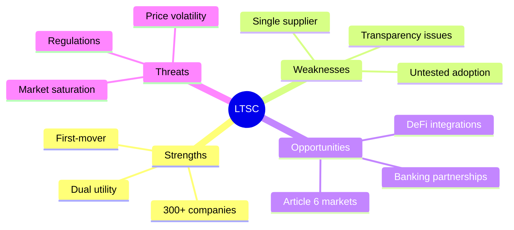
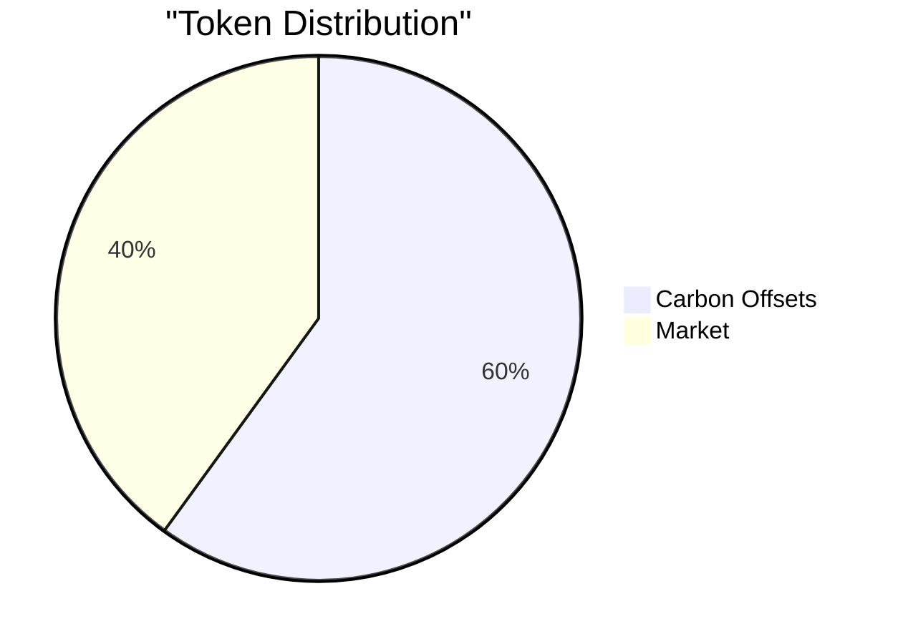
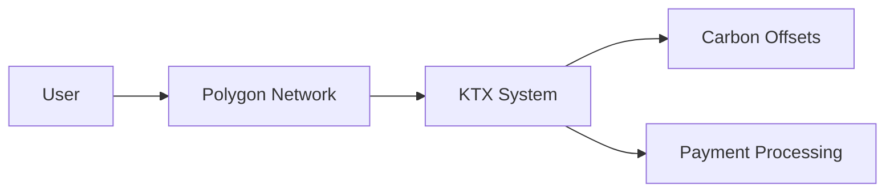
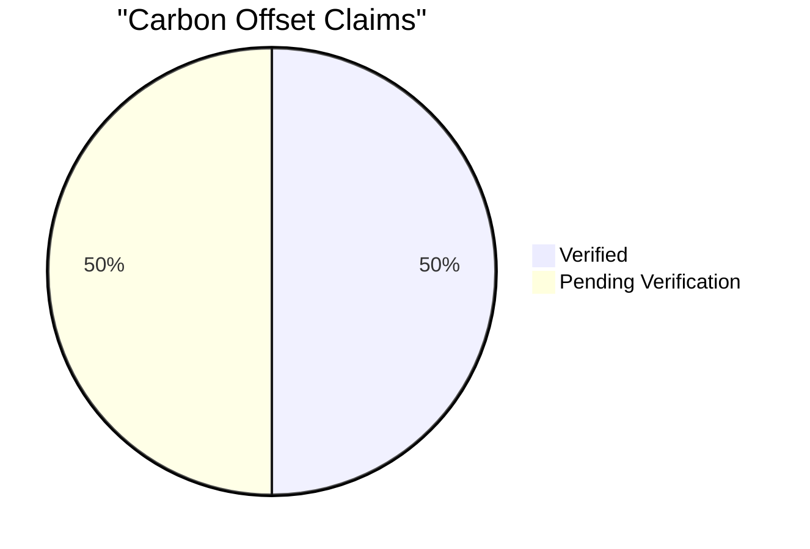
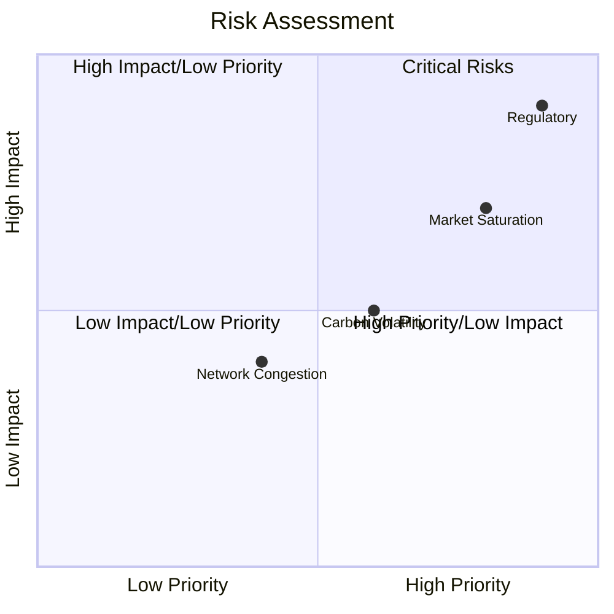
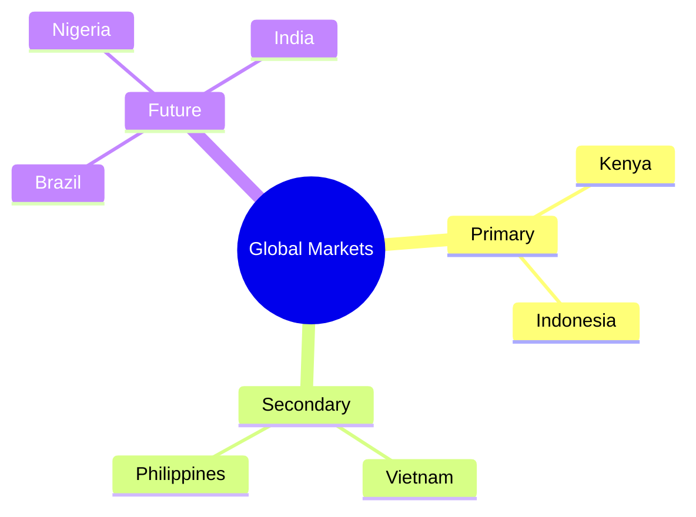
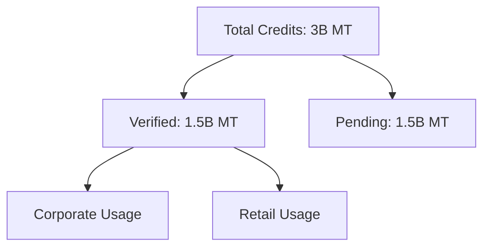

# Letscoin (LTSC) Comprehensive Analysis

## Executive Summary 
Letscoin (LTSC) integrates a payment stablecoin with carbon offsetting on the Polygon network. It aims to provide a cost-efficient and ESG-focused payment solution.



## Technical Audit 

### Tokenomics


### Technology Architecture


### Carbon Integration Stats


## Market Penetration Roadmap

```mermaid
gantt
        title Project Timeline
        dateFormat  YYYY-Q1
        section Phase 1
        Enhance Transparency    :2025-Q1, 6m
        section Phase 2
        Partnerships & Pilots   :2025-Q3, 6m
        section Phase 3
        Market Growth          :2026-Q1, 12m
```

## Risk Mitigation Matrix


## Geographic Expansion Heatmap


## Carbon Impact Dashboard

